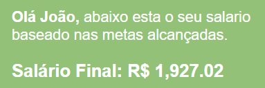
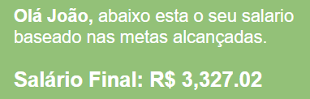

# sistema-de-meritocracia
# 📈 Sistema de Salário 
O Sistema de Salário para Vendedores simplifica o cálculo do salário com base nas *metas de vendas semanais e mensais.* Os vendedores inserem seus nomes e metas de vendas em um formulário, e um script PHP realiza os cálculos, mostrando o salário final na página.

## ✔️ Metas e Valores: 
1- Metas Semanais: $20,000  
2- Metas Mensais: $80,000  
3- Salário Mínimo: $1927.02  
4- Para o cumprimento de meta semanal: receberá  1% sobre o valor da meta.  
5- Para o excedente de meta semanal: Receberá 5% sobre o excedente da meta semanal.  
6- Para o excedente de meta mensal: Receberá 10% sobre o excedente de meta mensal.  

## ⚙️ Exemplo de funcionamento do sistema 
 
- Lembrando que...  
João deseja calcular seu salário com vendas de R$ 20.000,00 por semana durante 4 semanas, seguindo as regras propostas:

*É DEFINIDO:*  
- Salário Mínimo: R$ 1.927,02  
- Meta Semanal: R$ 20.000  
- Meta Mensal: R$ 80.000   
- Bônus para cumprimento de meta semanal: 1% sobre o valor da meta semanal
- Bônus para excedente de meta semanal: 5% sobre o excedente da meta semanal
- Bônus para excedente de meta mensal: 10% sobre o excedente da meta mensal

Vamos calcular o salário final de João que é de R$ 20.000,00 de vendas por semana durante as 4 semanas:

**Bônus para cumprimento da meta semanal:**

R$ 20.000,00 (meta semanal) * 1% = R$ 200,00 (por semana)  
R$ 200,00 * 4 semanas = R$ 800,00

**Bônus para excedente da meta semanal:**

Não há excedente de meta semanal porque João atingiu exatamente a meta todas as semanas.

**Bônus para excedente da meta mensal:**

Não há excedente de meta mensal porque João não ultrapassou a meta mensal de R$ 80.000,00.

**Calculando o salário final:**

Salário Final = Salário Mínimo + Bônus para cumprimento da meta semanal  
= R$ 1927,02 + R$ 800,00  
= R$ 2727,02

*Sendo assim, o salário final de João que atinge R$ 20.000,00 de vendas por semana durante 4 semanas é de **R$ 2727,02**.*

## Exemplos
*Conforme você ultrapassa as metas o valor a porcentagem é adicionada ou seja conforme os dados inseridos ira exibir um resultado especifico.*    
1- Se o vendedor não atingir a meta:  
- Adicionando em todas semanas 10.000 o valor mensal totaliza 40.000.     
 

2- Se caso o vendedor atingir a meta como no exemplo citado irá exibir um resultado:  
- Adicionando em todas semanas 20.000 o valor mensal totaliza 80.000.     
  

3- Se caso o vendedor ultrapassar a meta:  
- Adicionando em todas semanas 30.000 o valor mensal totaliza 120.000.  
  

## 📌 Funções de cada linguagem 

**HTML:** O código começa com um formulário HTML onde os usuários podem inserir informações, como o nome do vendedor, vendas semanais para cada uma das quatro semanas e vendas totais do mês.

**PHP:** Após o envio do formulário (quando o método de requisição é POST), o PHP processa os dados enviados. Ele verifica se os campos do nome do vendedor e as vendas totais do mês foram preenchidos. Em seguida, ele calcula o salário final do vendedor com base nas vendas semanais e mensais.

**Cálculo do Salário:** O código PHP define algumas variáveis, como o salário mínimo, metas semanais e mensais de vendas e bônus semanal e mensal. Ele itera sobre as vendas semanais para calcular o bônus semanal, adicionando um bônus extra se as vendas excederem a meta semanal. Em seguida, verifica se as vendas totais do mês atingiram a meta mensal e calcula o bônus mensal, se aplicável. Por fim, calcula o salário final somando o salário mínimo com os bônus semanal e mensal.

**Exibição do Resultado:** O resultado do cálculo é exibido abaixo do formulário, mostrando o nome do vendedor e o salário final formatado em reais (R$).

## 🎨 Estilizando
- Foi usada a paleta de *cor nº 45* do site Mambo Mambo, que usa tons de amarelo, verde e azul. Esta combinação transmite uma sensação tropical e descontraída. [Ver paleta](https://www.canva.com/pt_br/aprenda/cores-para-sites-50-paginas-impactantes/)

### 📚 Referências

- [Piso Regional do Paraná](https://www.aen.pr.gov.br/Noticia/Maior-do-Brasil-governador-confirma-novo-Piso-Regional-que-vai-de-R-18-mil-R-21-mil#:~:text=Na%20primeira%2C%20que%20contempla%20os,de%20R%24%201.927%2C02/)
- [PDF Contexto]()

## 👩‍💻 Feito por:

**Larissa Manrique**
- [GitHub](https://github.com/larissassk)
- [LinkedIn](https://www.linkedin.com/in/larissa-manrique/)
